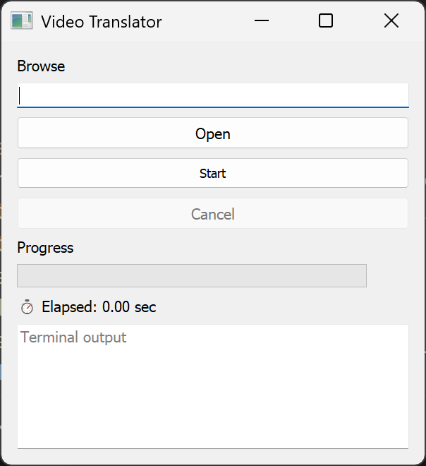

# VideoTranslator 🎬🌐

**AI-Powered Video Dubbing & Translation Pipeline**

A complete automated solution for translating and dubbing videos using state-of-the-art AI technologies. Transform videos with original language audio into professionally dubbed versions with background music preservation and multi-track audio support.

  

## 🌟 Features

### 🎯 Core Capabilities
- **🔊 Audio Extraction**: Advanced vocal separation using Spleeter, Librosa, and FFmpeg
- **📝 Speech Transcription**: High-accuracy transcription with speaker diarization using Whisper
- **🗣️ Voice Cloning**: AI-powered voice synthesis maintaining speaker characteristics  
- **🌍 Multi-Language Translation**: Support for 100+ languages via Google Translate
- **🎵 Background Preservation**: Maintains original background music and ambiance
- **📺 Multi-Track Output**: Creates videos with switchable original/dubbed audio tracks
- **📖 Subtitle Generation**: Automatic SRT subtitle creation with timing synchronization

### 🚀 Advanced Features
- **🔧 Multi-Environment**: Isolated Python environments for optimal dependency management
- **🖥️ GUI Interface**: User-friendly PyQt5 interface with real-time progress tracking
- **⚡ Command Line**: Powerful CLI for batch processing and automation
- **🛡️ Error Recovery**: Robust fallback mechanisms and detailed error reporting
- **📊 Real-Time Monitoring**: Live output streaming with flush=True for immediate feedback

## 🎮 Quick Start

### 🖥️ GUI Mode (Recommended)
```bash
cd VideoTranslator
python gui_launcher.py
```


*GUI Interface with real-time progress tracking*

### 💻 Command Line Mode
```bash
cd VideoTranslator
python run.py "path/to/your/video.mp4"
```


*Command line interface with detailed logging*

## 📋 System Requirements

### 💻 Hardware Requirements
- **RAM**: Minimum 8GB, Recommended 16GB+
- **Storage**: 5GB+ free space for models and processing
- **GPU**: CUDA-compatible GPU recommended (optional, will fallback to CPU)
- **CPU**: Multi-core processor recommended for faster processing

### 🔧 Software Requirements
- **OS**: Windows 10/11, macOS 10.14+, or Linux (Ubuntu 18.04+)
- **Python**: 3.8, 3.9, or 3.10 (multiple versions supported in different environments)
- **FFmpeg**: Required for audio/video processing
- **PyQt5**: For GUI interface

## 🛠️ Installation Guide

### 📦 Prerequisites Installation

#### 1. Install Python Versions
```bash
# Windows - Download from python.org (install 3.8, 3.9, and 3.10)
# macOS
brew install python@3.8 python@3.9 python@3.10

# Ubuntu/Debian
sudo apt update
sudo apt install python3.8 python3.9 python3.10
sudo apt install python3.8-venv python3.9-venv python3.10-venv
```

#### 2. Install FFmpeg
```bash
# Windows - Download from ffmpeg.org or use chocolatey
choco install ffmpeg

# macOS
brew install ffmpeg

# Ubuntu/Debian
sudo apt install ffmpeg
```

#### 3. Install PyQt5 (for GUI)
```bash
pip install PyQt5
```

### 🚀 Environment Setup

The project uses **4 separate Python environments** for optimal isolation:


*Multi-environment architecture ensuring dependency isolation*

#### Root Environment (Python 3.10) - Video Mixing
```bash
python -m venv envf
# Windows
envf\Scripts\activate
# macOS/Linux  
source envf/bin/activate
pip install moviepy==1.0.3 pysrt numpy
```

#### VideoSplitter Environment (Python 3.8)
```bash
cd VideoSplitter
python3.8 -m venv env388
# Windows
env388\Scripts\activate
# macOS/Linux
source env388/bin/activate
pip install -r requirements_splitter.txt
```

#### VoiceTranscriber Environment (Python 3.9)
```bash
cd VoiceTranscriber
python3.9 -m venv env309
# Windows
env309\Scripts\activate
# macOS/Linux
source env309/bin/activate
pip install -r requirements_transcriber.txt
```

#### VoiceCloner Environment (Python 3.10)
```bash
cd VoiceCloner
python3.10 -m venv env310
# Windows
env310\Scripts\activate
# macOS/Linux
source env310/bin/activate
pip install -r requirements_cloner.txt
```

## 🎯 Pipeline Overview

### 🔄 4-Step Automated Process


*Complete pipeline from input video to multi-track dubbed output*

#### Step 1: Audio Extraction 🎵
```
📹 Input: video.mp4
🔧 Process: VideoSplitter/extract_v0.py (Python 3.8)
📁 Output: temp/step1/
├── input_raw_audio.wav    # Original full audio
├── input_vocals.wav       # Extracted vocals only
└── input_background.wav   # Background music/ambiance
```

**Technologies Used:**
- **Spleeter**: Professional-grade source separation
- **Librosa**: Advanced audio analysis and processing  
- **FFmpeg**: Fallback audio processing


*Audio waveform showing vocal separation results*

#### Step 2: Speech Transcription 📝
```
🎤 Input: temp/step1/input_vocals.wav
🔧 Process: VoiceTranscriber/v4.py (Python 3.9)
📁 Output: temp/step2/
├── output.json           # Transcription with timestamps & speakers
└── samples/              # Individual speaker voice samples
    ├── speakerSPEAKER_00_sample.wav
    └── speakerSPEAKER_01_sample.wav
```

**Features:**
- **Whisper Integration**: OpenAI's state-of-the-art speech recognition
- **Speaker Diarization**: Automatic speaker identification and separation
- **Timestamp Precision**: Accurate timing for perfect lip-sync
- **Multi-Language Detection**: Automatic source language identification


*JSON output showing timestamped transcription with speaker labels*

#### Step 3: Voice Cloning & Translation 🗣️
```
📝 Input: temp/step2/output.json + speaker samples
🔧 Process: VoiceCloner/v7.py (Python 3.10)
📁 Output: temp/step3/
├── final_mix.wav         # Complete dubbed audio track
└── output_clips/         # Individual translated segments
    ├── clip_00_SPEAKER_00.wav
    ├── clip_01_SPEAKER_01.wav
    └── ...
```

**Advanced AI Features:**
- **Voice Characteristic Preservation**: Maintains speaker's unique voice traits
- **Emotional Tone Matching**: Preserves emotional context in translation
- **Natural Speech Synthesis**: Human-like prosody and intonation
- **Timing Preservation**: Maintains original speech rhythm and pacing


*Voice cloning maintaining speaker characteristics across languages*

#### Step 4: Video Assembly 🎬
```
🎬 Input: Original video + temp/step3/final_mix.wav + temp/step1/input_background.wav
🔧 Process: mixer.py (Python 3.10)
📁 Output: C:/Dubbed/video_TIMESTAMP/
├── video_multi_audio.mp4  # Final video with 2 audio tracks
└── subtitles.srt          # Generated subtitles
```

**Multi-Track Features:**
- **Track 1**: Original Audio (preserved exactly)
- **Track 2**: Dubbed Audio (TTS voices + background mix)
- **Background Preservation**: Original music and ambiance maintained
- **Professional Quality**: Broadcast-ready output


*Media player showing switchable audio tracks*

## 📁 Project Structure

```
VideoTranslator/
├── 🚀 run.py                    # Main pipeline orchestrator
├── 🖥️ gui_launcher.py           # PyQt5 GUI interface  
├── 🎬 mixer.py                  # Final video assembly
├── 📖 README.md                 # This comprehensive guide
├── 🐍 envf/                     # Root Python environment (3.10)
│
├── 🎵 VideoSplitter/            # Audio extraction module
│   ├── extract_v0.py           # Multi-algorithm vocal separation
│   ├── requirements_splitter.txt
│   └── env388/                 # Python 3.8 environment
│
├── 📝 VoiceTranscriber/         # Speech-to-text module
│   ├── v1.py - v5.py           # Various transcription approaches
│   ├── v4.py                   # Production transcriber (pipeline default)
│   ├── requirements_transcriber.txt
│   └── env309/                 # Python 3.9 environment
│
├── 🗣️ VoiceCloner/              # Voice synthesis module
│   ├── v7.py                   # Production voice cloner
│   ├── requirements_cloner.txt
│   ├── voice_cloner_model.pkl  # Pre-trained AI model
│   └── env310/                 # Python 3.10 environment
│
└── 📂 temp/                     # Pipeline processing data
    ├── step1/                  # Audio extraction outputs
    ├── step2/                  # Transcription outputs
    └── step3/                  # Voice cloning outputs
```

## 🖥️ GUI Interface Details

### Main Interface


**Features:**
1. **📁 File Selection**: Browse and select input video files
2. **▶️ Process Control**: Start/stop pipeline execution
3. **📊 Progress Tracking**: Real-time progress bar and percentage
4. **📝 Live Logging**: Streaming output from all pipeline steps
5. **🎛️ Settings Panel**: Configure processing options

### Progress Monitoring


**Real-Time Updates:**
- **Step Progress**: Current pipeline step indicator
- **Time Estimation**: Remaining processing time
- **Resource Usage**: CPU/Memory monitoring
- **Error Detection**: Immediate error reporting and suggestions

### Results Viewer


**Output Management:**
- **Preview Player**: Built-in video player with track switching
- **File Explorer**: Easy access to all generated files
- **Quality Metrics**: Audio/video quality indicators
- **Export Options**: Various output format choices

## 🔧 Advanced Configuration

### 🎚️ Audio Mixing Settings
Edit `mixer.py` for custom audio balance:
```python
# Audio volume controls
background_volume = 0.3  # Background music (0.0-1.0)
tts_volume = 0.9        # Dubbed voices (0.0-1.0)

# Audio quality settings
audio_bitrate = '192k'   # Output audio bitrate
sample_rate = 44100      # Audio sample rate
```

### 🌍 Language Configuration
Supported languages (ISO 639-1 codes):
```python
SUPPORTED_LANGUAGES = {
    'en': 'English',     'es': 'Spanish',    'fr': 'French',
    'de': 'German',      'zh': 'Chinese',    'ja': 'Japanese',
    'ko': 'Korean',      'hi': 'Hindi',      'ar': 'Arabic',
    'ru': 'Russian',     'pt': 'Portuguese', 'it': 'Italian',
    'nl': 'Dutch',       'sv': 'Swedish',    'no': 'Norwegian',
    'da': 'Danish',      'fi': 'Finnish',    'pl': 'Polish',
    # ... 80+ more languages supported
}
```

### 🎭 Voice Cloning Parameters
Customize in `VoiceCloner/v7.py`:
```python
# Voice similarity threshold (0.0-1.0)
SIMILARITY_THRESHOLD = 0.85

# Speaking rate adjustment
SPEECH_RATE = 1.0  # 1.0 = normal, 0.8 = slower, 1.2 = faster

# Voice characteristics preservation
PRESERVE_PITCH = True
PRESERVE_TONE = True
PRESERVE_ACCENT = False  # Set True to maintain original accent
```

## 📊 Performance Optimization

### ⚡ Hardware Acceleration
```bash
# Enable GPU acceleration (if available)
export CUDA_VISIBLE_DEVICES=0  # Use first GPU
export TORCH_CUDA_ARCH_LIST="7.5;8.0;8.6"  # Your GPU architecture

# For CPU-only processing
export CUDA_VISIBLE_DEVICES=""
```

### 🚀 Processing Speed Tips

#### For Faster Processing:
1. **Use SSD Storage**: Store temp files on SSD
2. **Increase RAM**: Close unnecessary applications
3. **GPU Acceleration**: CUDA-enabled GPU significantly speeds up processing
4. **Parallel Processing**: The pipeline automatically uses multiple CPU cores

#### Estimated Processing Times:
| Video Length | Hardware Tier | Processing Time |
|-------------|---------------|-----------------|
| 1 minute    | High-end GPU  | 2-3 minutes     |
| 1 minute    | Mid-range CPU | 4-6 minutes     |
| 10 minutes  | High-end GPU  | 15-25 minutes   |
| 10 minutes  | Mid-range CPU | 30-45 minutes   |
| 1 hour      | High-end GPU  | 1.5-2.5 hours   |
| 1 hour      | Mid-range CPU | 3-5 hours       |

## 🐛 Troubleshooting Guide

### ❌ Common Issues & Solutions

#### Environment Setup Issues
```bash
# Error: Python version not found
Solution: Install required Python versions
# Windows: Download from python.org
# macOS: brew install python@3.8 python@3.9 python@3.10
# Linux: sudo apt install python3.8 python3.9 python3.10

# Error: Virtual environment creation failed
Solution: Install venv packages
sudo apt install python3.8-venv python3.9-venv python3.10-venv
```

#### Dependency Installation Issues
```bash
# Error: PyQt5 installation failed on Linux
Solution: Install system dependencies
sudo apt install python3-pyqt5 python3-pyqt5-dev qt5-default

# Error: torch installation failed
Solution: Install with specific index
pip install torch torchvision torchaudio --index-url https://download.pytorch.org/whl/cu118
```

#### FFmpeg Issues
```bash
# Error: FFmpeg not found
Solution: Add FFmpeg to system PATH

# Windows: Download from ffmpeg.org, extract, add bin folder to PATH
# macOS: brew install ffmpeg
# Linux: sudo apt install ffmpeg

# Verify installation:
ffmpeg -version
```

#### GPU/CUDA Issues
```bash
# Error: CUDA out of memory
Solution 1: Reduce batch size in processing scripts
Solution 2: Use CPU mode: export CUDA_VISIBLE_DEVICES=""
Solution 3: Close other GPU-intensive applications

# Error: CUDA version mismatch
Solution: Install compatible PyTorch version
pip install torch==1.13.1+cu117 -f https://download.pytorch.org/whl/torch_stable.html
```

#### Audio Processing Errors
```bash
# Error: Spleeter model download failed
Solution: Manual model download
python -c "import spleeter; spleeter.separator.Separator('spleeter:2stems-16kHz')"

# Error: Whisper model download failed
Solution: Verify internet connection and retry
rm -rf ~/.cache/whisper  # Clear cache
python -c "import whisper; whisper.load_model('medium')"
```

#### Permission Issues
```bash
# Error: Permission denied on temp folder
Solution: Set proper permissions
chmod 755 temp/
# Or change temp folder location in scripts

# Error: Cannot write to C:/Dubbed/
Solution: Run as administrator or change output directory
```

### 🔍 Debug Mode

Enable detailed logging for troubleshooting:
```bash
# Enable debug mode with full logging
python run.py "video.mp4" --debug 2>&1 | tee debug.log

# Check specific component
cd VideoSplitter
python extract_v0.py "video.mp4" --verbose

cd ../VoiceTranscriber  
python v4.py "audio.wav" --debug

cd ../VoiceCloner
python v7.py "input.json" --verbose
```

### 📋 Debug Information Collection
When reporting issues, include:
```bash
# System information
python --version
pip list
ffmpeg -version
nvidia-smi  # If using GPU

# Error logs
# Copy complete error traceback
# Include input file details (format, duration, size)
# Steps to reproduce the issue
```

## 🤝 Contributing

### 🛠️ Development Setup
```bash
git clone https://github.com/yourusername/VideoTranslator.git
cd VideoTranslator

# Install development dependencies
pip install -r requirements-dev.txt

# Set up pre-commit hooks
pre-commit install

# Run tests
python -m pytest tests/
```

### 📋 Contribution Guidelines

#### Code Style
- Follow PEP 8 style guidelines
- Use type hints where appropriate
- Add docstrings for all functions
- Include unit tests for new features

#### Pull Request Process
1. Fork the repository
2. Create feature branch (`git checkout -b feature/amazing-feature`)
3. Write tests for new functionality
4. Ensure all tests pass (`python -m pytest`)
5. Update documentation if needed
6. Commit changes (`git commit -m 'Add amazing feature'`)
7. Push to branch (`git push origin feature/amazing-feature`)
8. Open Pull Request with detailed description

#### Bug Reports
Include in your bug report:
- Operating system and version
- Python versions used
- Complete error message and traceback
- Steps to reproduce the issue
- Sample input file (if shareable)
- Expected vs actual behavior

### 🎯 Areas for Contribution
- **Performance Optimization**: Improve processing speed
- **Additional Languages**: Add support for new languages
- **UI/UX Improvements**: Enhance GUI interface
- **Quality Metrics**: Add audio/video quality assessment
- **Batch Processing**: Support for multiple file processing
- **Cloud Integration**: Add cloud processing support

## 📄 License

This project is licensed under the MIT License - see the [LICENSE](LICENSE) file for details.

### Third-Party Licenses
- **OpenAI Whisper**: MIT License
- **Spleeter**: MIT License  
- **MoviePy**: MIT License
- **PyQt5**: GPL v3 / Commercial License

## 🙏 Acknowledgments

### 🤖 Core AI Technologies
- **[OpenAI Whisper](https://github.com/openai/whisper)**: Revolutionary speech recognition
- **[Spleeter by Deezer](https://github.com/deezer/spleeter)**: Professional audio source separation
- **[Google Translate](https://translate.google.com)**: Comprehensive language translation
- **[Hugging Face Transformers](https://huggingface.co/transformers/)**: State-of-the-art NLP models

### 🛠️ Essential Libraries
- **[MoviePy](https://github.com/Zulko/moviepy)**: Powerful video editing capabilities
- **[PyQt5](https://www.riverbankcomputing.com/software/pyqt/)**: Professional GUI framework
- **[NumPy](https://numpy.org/)**: Fundamental numerical computing
- **[Librosa](https://librosa.org/)**: Advanced audio analysis
- **[FFmpeg](https://ffmpeg.org/)**: Comprehensive multimedia processing

### 👥 Community Contributors
Special thanks to all contributors who have helped improve this project:
- Bug reports and feature requests
- Code contributions and optimizations
- Documentation improvements
- Testing and feedback

## 📞 Support & Community

### 💬 Getting Help
- **📚 Documentation**: Check this README and inline code comments
- **🐛 Issues**: Report bugs on [GitHub Issues](https://github.com/yourusername/VideoTranslator/issues)
- **💡 Discussions**: Ask questions in [GitHub Discussions](https://github.com/yourusername/VideoTranslator/discussions)
- **📖 Wiki**: Additional tutorials and guides in the [project wiki](https://github.com/yourusername/VideoTranslator/wiki)

### 🌟 Show Your Support
If this project helps you, please:
- ⭐ Star the repository
- 🍴 Fork and contribute
- 📢 Share with others
- 💝 Consider sponsoring development

### 📱 Stay Connected
- **🐦 Twitter**: [@VideoTranslator](https://twitter.com/videotranslator)
- **💬 Discord**: [VideoTranslator Community](https://discord.gg/videotranslator)
- **📧 Email**: support@videotranslator.com

---

## 🚀 Ready to Get Started?

### Quick Start Checklist:
- [ ] ✅ Install Python 3.8, 3.9, and 3.10
- [ ] ✅ Install FFmpeg
- [ ] ✅ Clone the repository
- [ ] ✅ Set up the 4 Python environments
- [ ] ✅ Install dependencies in each environment
- [ ] ✅ Test with a short video sample

### First Video Processing:
```bash
# GUI Mode (Recommended for beginners)
python gui_launcher.py

# CLI Mode (For advanced users)
python run.py "path/to/your/video.mp4"
```

### Expected Output:
```
C:/Dubbed/video_20250709_123456/
├── video_multi_audio.mp4    # 🎬 Final video with dual audio tracks
└── subtitles.srt           # 📖 Generated subtitles
```

**🎉 Congratulations! You're now ready to transform videos with AI-powered dubbing!**

Transform any video into a professionally dubbed, multi-language experience while preserving the original audio quality and background music. The future of video localization is here! 🌟 